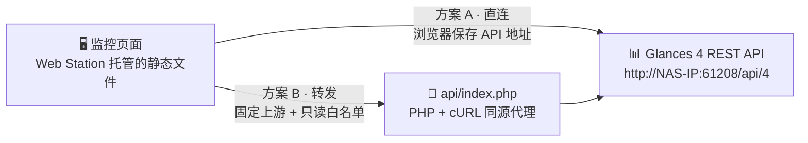
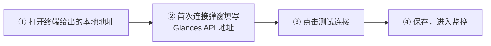
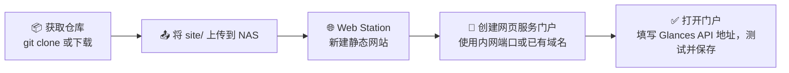
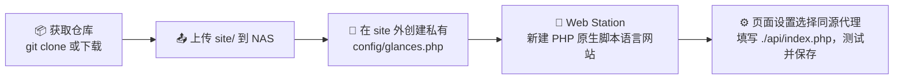

<div align="center">

# NAS Dashboard

**中文 NAS 监控面板** · 读取 Glances 4 REST API · 由群晖 Web Station 原生托管

部署后第一次访问填写 API 地址即可使用；地址与展示偏好仅保存在当前浏览器。
不内置 NAS IP，也不需要为面板额外运行 nginx 容器。

[](https://nodejs.org)
[](#-验证)
[](#-部署到群晖-web-station)
[](https://glances.readthedocs.io/en/latest/api/restful.html)
[](./LICENSE)

[功能一览](#-功能一览) · [数据链路](#-数据链路) · [快速开始](#-快速开始) · [部署上线](#-部署到群晖-web-station) · [常见问题](#-常见问题与排查) · [配置项](#-站点默认配置) · [使用须知](#-使用须知)

</div>

---

## ✨ 功能一览

| 模块        | 内容                                                     |
| ----------- | -------------------------------------------------------- |
| 🖥️ 系统资源 | CPU、内存、1/5/15 分钟负载、已提供的温度传感器           |
| 💾 存储卷   | 容量、已用与剩余空间，默认筛选 `/volume1`、`/volume2` 等 |
| 🌐 网络     | 每秒收发速率、接口筛选，以及 CPU / 内存 / 网络趋势图     |
| 📦 容器     | 运行与健康状态、CPU、内存，支持状态筛选和分页            |

所有模块共享：

- 自动刷新、手动刷新、暂停；请求完成后再安排下一次，不会重叠。
- 缺失指标显示 `--`，部分失败与数据过期状态始终可见。
- 首次连接弹窗引导填写地址；保存时检查地址格式，也可先点击"测试连接"确认可用。

## 🧭 数据链路

页面本身是纯静态文件，由 Web Station 托管；数据获取有两条路径，按需选择：



- **方案 A 直连**：浏览器直接访问你填写的 Glances API，依赖 Glances 的 CORS 配置。
- **方案 B 代理**：请求先发给同源的 `api/index.php`，由 PHP 转发到固定上游，
  上游凭据只存在服务端。

## 🚀 快速开始

### 前置要求

- 开发电脑安装 Node.js 22.12+ 或 24（NAS 上不需要 Node.js）。
- NAS 上运行着 Glances Web 模式（如 `glances -w`），API 地址形如
  `http://NAS-IP:61208/api/4`。

### 本地运行

```sh
npm ci
npm run dev
```



- 地址支持完整形式 `http://NAS-IP:61208/api/4`，也支持省略协议，直接输入
  `NAS-IP:61208/api/4`。
- 想先看效果？通过 `?demo=1` 或设置中的演示开关查看模拟数据，页面会显式标记
  "演示数据"。

### 本地调试同源代理

```sh
cp .env.example .env.local   # 填写 GLANCES_API_URL
npm run dev                  # 填写后（重新）启动开发服务
```

在设置中选择"同源代理"，地址使用 `./api/index.php`。该环境变量只由本地开发服务
（`scripts/serve.mjs`）读取，页面不包含任何服务器地址。

## 📦 部署到群晖 Web Station

### 部署前置

1. 在套件中心安装 **Web Station**；方案 B 还需确认 PHP（8.1+）已安装，并在
   Web Station → PHP 设置中启用 `curl` 扩展。
2. 规划 NAS 上的目录，例如 `/volume3/Video/web/nas-dashboard/`，并确认要使用的
   门户端口未被占用。
3. NAS 已运行 Glances Web 模式并记下地址（`http://NAS-IP:61208/api/4`）。常见
   安装方式：Docker 镜像 `nicolargo/glances`（设置 `GLANCES_OPT=-w`）或通过
   套件 / 包管理器安装。

### 方案对比

|                   | 方案 A · 静态站点            | 方案 B · PHP 同源代理                 |
| ----------------- | ---------------------------- | ------------------------------------- |
| 上手难度          | 最简单                       | 需要配置 PHP                          |
| API 地址由谁提供  | 每位用户在浏览器里填写       | 服务端 `config/glances.php` 固定      |
| Glances 需开 CORS | 是                           | 否                                    |
| Glances 开启认证  | 不建议，建议改用方案 B       | 支持，凭据只存在服务端                |
| HTTPS 限制        | HTTPS 页面必须连接 HTTPS API | 无此限制（同源转发）                  |
| NAS 端要求        | 仅 Web Station               | Web Station + PHP 8.1+（启用 `curl`） |

### 方案 A：静态站点



1. 将仓库中的 `site/` 目录上传到 NAS，例如
   `/volume3/Video/web/nas-dashboard/site`。无需任何构建步骤。
2. 在 Web Station 创建静态网站，文档根目录选择上述 `site` 目录。
3. 创建网页服务门户，使用你的内网端口或已有域名；`http` 组须有读取权限。
4. 打开门户，填写你的 Glances API 地址，测试并保存。

说明：

- Web Station 只需要 `site/` 里的静态文件，NAS 和开发电脑都不需要构建步骤。
- 发布新版本：更新仓库后重新拷贝 `site/`。站点源码直接提交在 `site/` 目录，
  若 NAS 上克隆了仓库，`git pull` 即完成发布，没有编译产物环节。
- HTTP 内网页面可连接 HTTP API；HTTPS 页面必须连接 HTTPS API，或改用方案 B。
  浏览器设置弹窗会检查这个限制。
- 直连依赖 Glances 的 CORS 配置；最新版本的默认设置允许不带凭据的跨域访问，
  实际行为以你安装的 Glances 版本和配置为准。

### 可选：生成部署 ZIP

在开发电脑上使用 `zip` 打包即可，不需要编译。使用新的临时目录，避免旧 ZIP 中
残留已经删除的文件。解压后，将 Web Station 的文档根目录指向 `site/`。

```sh
package_dir="$(mktemp -d)"
zip -qr "$package_dir/nas-dashboard-webstation.zip" site config/glances.example.php README.md LICENSE
mkdir -p artifacts
mv "$package_dir/nas-dashboard-webstation.zip" artifacts/nas-dashboard-webstation.zip
rmdir "$package_dir"
```

只打包上述发布文件，私有 `config/glances.php`、`.env`、开发依赖和测试结果不进入
部署包。`artifacts/` 已被 Git 忽略；使用 NAS 上的 `git pull` 更新时不需要生成 ZIP。

### 方案 B：PHP 同源代理



1. 创建 Web Station 原生脚本语言网站，使用 PHP 8.1+，启用 `curl` 扩展。
2. 文档根目录指向 NAS 上的 `site` 目录（名称可自定），不需要修改 DSM nginx
   配置。
3. 保持以下布局，`config/` 必须位于所有公开网页根目录之外：

   ```text
   /volume3/Video/web/nas-dashboard/
   ├── config/
   │   └── glances.php          ← 私有配置，绝不放入 site/
   └── site/                    ← Web Station 文档根目录
       ├── index.html
       ├── config.json
       ├── styles.css
       ├── js/
       ├── vendor/
       ├── favicon.svg
       └── api/index.php
   ```

4. 使用仓库中的 `config/glances.example.php` 创建私有 `config/glances.php`，填写
   `api_url`。需要上游认证时，填写 `username` / `password` 或 `token`。
5. 允许 PHP 读取这个配置路径，包括 `open_basedir` 和 `http` 组读取权限；不要把
   私有配置复制进 `site/`。也可通过服务端环境变量 `GLANCES_CONFIG` 指定其他私有
   绝对路径。
6. 页面设置选择"同源代理"，填写 `./api/index.php`，测试并保存。

代理安全边界：

- 只接受 GET 请求和已允许的监控插件，从管理员配置读取固定上游，不接受浏览器
  提供的目标主机。
- CPU、内存、网络、文件系统等各请求并行读取，某个插件失败不影响其他插件。
- 容器响应会移除命令等与本页面无关的字段；上游凭据不进入前端或 Git。
- 监控数据的访问控制由部署入口负责，生产门户可使用已有的 VPN 或认证入口。
- 更新版本只需替换 `site/`；私有 `config/glances.php` 与浏览器里保存的设置不受
  影响。

## 🧯 常见问题与排查

排查顺序建议：先看页面状态栏与设置里的“测试连接”，再看浏览器控制台；方案 B 还
可以直接查看 PHP 响应里的 `error` 字段，报错信息会指明问题出在扩展、配置还是
上游。

### 页面无法打开

| 现象                       | 可能原因                                                  | 处理方式                                      |
| -------------------------- | --------------------------------------------------------- | --------------------------------------------- |
| 门户 403 / 404             | Web Station 未启用、文档根目录指错、`http` 组没有读取权限 | 检查 Web Station 服务状态、门户与共享目录权限 |
| 页面能打开但样式或脚本 404 | 只上传了部分文件                                          | 完整上传 `site/`，包括 `js/` 与 `vendor/`     |

### 连接失败（方案 A 直连）

| 现象                          | 可能原因                                                  | 处理方式                                                  |
| ----------------------------- | --------------------------------------------------------- | --------------------------------------------------------- |
| “测试连接”失败                | Glances 未以 Web 模式运行、端口不对、防火墙未放行 `61208` | 先用浏览器直接打开 `http://NAS-IP:61208` 验证再回面板保存 |
| 控制台报 CORS 跨域错误        | Glances 的跨域配置拒绝了面板门户这个来源                  | 检查 Glances 配置的 `[cors]` 允许来源，或改用方案 B       |
| HTTPS 门户下请求被浏览器拦截  | 混合内容：HTTPS 页面不能请求 HTTP API                     | 为 Glances 启用 HTTPS，或改用同源代理（方案 B）           |
| Glances 开启认证后无法使用    | 直连模式没有安全保存凭据的位置                            | 改用方案 B，凭据只存在服务端的私有配置里                  |
| 地址能保存但所有指标都是 `--` | 保存时未先测试，实际连不上或 API 版本路径不对             | 在设置中“测试连接”，确认路径为 Glances 4 的 `/api/4`      |

### PHP 同源代理（方案 B）

| 现象                                                   | 可能原因                                                | 处理方式                                                            |
| ------------------------------------------------------ | ------------------------------------------------------- | ------------------------------------------------------------------- |
| 响应 503 `Enable the PHP curl extension`               | PHP 未启用 curl 扩展                                    | Web Station 的 PHP 设置中启用 curl                                  |
| 响应 503 `Configure the Glances API URL on the server` | 读不到 `config/glances.php`，或 `api_url` 缺协议 / 主机 | 文件放在 `site/` 之外；确认 `open_basedir` 允许读取；核对 `api_url` |
| 响应 503 `Invalid server configuration`                | 配置文件不是返回数组的 PHP 文件                         | 对照 `config/glances.example.php` 重写                              |
| 部分插件提示“Glances 无法连接或响应超时”               | 代理连不上上游（连接超时 2 秒）                         | 在 NAS 上执行 `curl http://127.0.0.1:61208/api/4/cpu` 验证          |
| 上游 HTTPS 报证书错误                                  | 代理强制校验上游证书，自签名证书会失败                  | 内网改用 HTTP 上游，或为上游配置受信任的证书                        |
| 响应 400 `Unsupported monitoring plugin`               | `plugins` 参数超出只读白名单                            | 正常由页面发起不会出现；手动调试请用白名单内的插件名                |

### 数据缺失或显示 `--`

| 现象                        | 可能原因                                              | 处理方式                                                        |
| --------------------------- | ----------------------------------------------------- | --------------------------------------------------------------- |
| 温度不显示                  | Glances 读不到温度传感器                              | 主机安装 lm-sensors；容器部署按官方镜像说明挂载 `/proc`、`/sys` |
| 存储卷为空                  | 挂载点不匹配 `volumePattern`（如 USB 卷、自定义挂载） | 调整 `site/config.json` 的 `volumePattern` 正则                 |
| 容器列表为空或无 CPU / 内存 | Glances 没有 Docker socket 权限                       | 给 Glances 挂载 `/var/run/docker.sock` 并授权                   |
| 网络速率缺失或为 0          | 速率来自两次采样的差值；虚拟接口被默认正则忽略        | 等待一个刷新周期；需要 docker / VPN 接口时显式配置接口列表      |

### 安全提醒

- Glances REST API 默认只读且无认证，`61208` 端口不要直接暴露公网；生产门户走
  VPN 或认证入口（方案 B 的访问控制同样由部署入口负责）。
- 私有 `config/glances.php`、`.env` 与任何凭据都不进入 `site/` 与 Git；一旦怀疑
  泄露，立即轮换 Glances 的账号、密码或 token。

## 🔧 站点默认配置

站点级默认值在 `site/config.json` 中，随 `site/` 一起发布。浏览器保存的连接设置
优先于默认值。公共配置不要填写密码或 token。

| 配置项                 | 说明                                                           | 默认值                                       |
| ---------------------- | -------------------------------------------------------------- | -------------------------------------------- |
| `name` / `subtitle`    | 设备名称和副标题                                               | `我的 NAS` · `Synology · 系统监控`           |
| `api`                  | 留空则首次访问填写；也可设置站点公共默认连接（`mode` + `url`） | `direct`，地址为空                           |
| `refreshSeconds`       | 更新间隔；请求完成后再安排下一次，避免重叠                     | `5`                                          |
| `timeoutSeconds`       | 单次请求超时时间                                               | `8`                                          |
| `historyMinutes`       | 页面内趋势采样的保留时长                                       | `15`                                         |
| `volumePattern`        | 存储卷筛选正则表达式                                           | `^/volume[0-9]+$`                            |
| `networkInterfaces`    | 显式接口列表；为空时忽略回环和常见虚拟接口，优先聚合接口       | `[]`（自动筛选）                             |
| `networkIgnorePattern` | 自动筛选时忽略的接口名正则                                     | `^(lo$\|docker\|veth\|br-\|virbr\|tun\|tap)` |
| `widgets`              | 默认启用的模块                                                 | `resources` `storage` `network` `containers` |
| `thresholds`           | CPU、内存、存储和温度提醒阈值                                  | 均为 `85`，温度 `70`                         |

## 🧩 扩展开发

新增一个监控模块：

1. 在 `site/js/core/types.js` 补充 JSDoc 类型，并实现 `WidgetDefinition`。
2. 注册到 `site/js/widgets/index.js`；模块声明 `plugins`，请求层会自动合并依赖。
3. 新增模块 ID 时，同步更新类型定义和默认配置。
4. 类型以 JSDoc 注解表达，`npm run typecheck` 用 tsc 做零产物校验，没有编译步骤。

新增一个 Glances API 插件时，同步更新 PHP 代理与开发代理的允许列表。
全局规范见 `AGENT.md`，视觉与交互约定见 `DESIGN.md`。

## ✅ 验证

| 命令                   | 作用                          |
| ---------------------- | ----------------------------- |
| `npm run typecheck`    | tsc 校验 JSDoc 类型（零产物） |
| `npm test`             | Vitest 单元测试               |
| `npm run format:check` | Prettier 格式检查             |
| `npm run test:e2e`     | Playwright 浏览器端到端测试   |

浏览器测试默认使用 Playwright 专用 Chromium，首次运行先执行
`npx playwright install chromium`；也可通过 `PLAYWRIGHT_CHANNEL=chrome` 选择已安装的
Chrome。原生下拉菜单使用浏览器选择 API 验证，键盘测试覆盖焦点、按钮和弹窗。

测试使用隔离配置和模拟接口，覆盖桌面与手机、首次配置、断线、部分失败、模块管理、
键盘、趋势绘制和自动无障碍检查。PHP 解析测试只验证语法，不替代 Web Station 的
PHP / cURL 运行时验证。

## 📌 使用须知

- 趋势只记录当前打开页面期间的采样，不代表 NAS 的长期历史。
- 演示模式显式标记"演示数据"；连接失败不会切换成模拟数值。
- 磁盘容量不代表 RAID 或 SMART 健康。
- 网络速率使用 `bytes_recv_rate_per_sec` / `bytes_sent_rate_per_sec`；
  `time_since_update` 是采样年龄，不能拿来计算每秒速率。
- Glances 容器能看到多少挂载点、温度、容器，页面就展示多少；缺失数据优先检查
  Glances 的权限和挂载。

## 📚 参考链接

随站点分发的 Chart.js 与 Lucide 版权和许可证文本保存在
[`site/vendor/LICENSES.txt`](./site/vendor/LICENSES.txt)，部署时随 `site/` 一起保留。

- [Glances 官方 REST API 文档](https://glances.readthedocs.io/en/latest/api/restful.html)
- [Synology Web Station 部署文档](https://kb.synology.com/en-id/DSM/tutorial/How_to_host_a_website_on_Synology_NAS)

---

<div align="center">

基于 [MIT License](./LICENSE) 发布 · 监控数据仅供日常巡检参考

</div>
