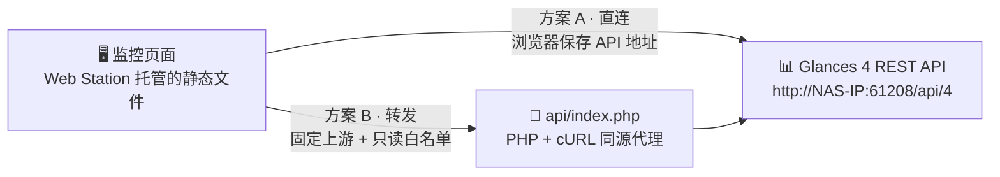

<div align="center">

# NAS Dashboard

**中文 NAS 监控面板** · 读取 Glances 4 REST API · Web Station 托管 · Docker 可选同步代码

部署后第一次访问填写 API 地址即可使用；地址与展示偏好仅保存在当前浏览器。
Web Station 负责网站服务；Docker 只负责把仓库同步到指定 NAS 目录。

[](https://nodejs.org)
[](#-验证)
[](#-部署到-nas)
[](https://glances.readthedocs.io/en/latest/api/restful.html)
[](./LICENSE)

[功能一览](#-功能一览) · [数据链路](#-数据链路) · [快速开始](#-快速开始) · [部署上线](#-部署到-nas) · [常见问题](#-常见问题与排查) · [配置项](#-站点默认配置) · [使用须知](#-使用须知)

</div>

---

## ✨ 功能一览

概览页 + 四个分类详情页，hash 路由切换视图（移动端在顶栏下方提供横向切换条）：

| 模块        | 概览摘要               | 详情页追加内容                                 |
| ----------- | ---------------------- | ---------------------------------------------- |
| 🖥️ 系统资源 | 指标卡 + CPU/内存趋势  | CPU 分解、全部温度传感器、系统信息、独立趋势图 |
| 💾 存储卷   | 各卷容量列表           | 容量汇总、每卷设备名与文件系统明细             |
| 🌐 网络     | 收发速率趋势与接口筛选 | 接口明细：链路状态、速率、累计收发字节         |
| 📦 容器     | 状态/CPU/内存表格      | 运行汇总（总数/CPU 与内存合计）、可排序明细表  |

所有模块共享：

- 自动刷新、手动刷新、暂停；请求完成后再安排下一次，不会重叠。
- 缺失指标显示 `--`，部分失败与数据过期状态始终可见。
- 首次连接弹窗引导填写地址，可先“测试连接”确认可用再保存。

## 🧭 数据链路



- **方案 A 直连**：浏览器直接访问你填写的 Glances API，依赖 Glances 的 CORS 配置。
- **方案 B 代理**：请求先发给同源的 `api/index.php`，由 PHP 转发到固定上游，上游凭据只存在服务端。
- **方案 C** 只改变代码获取与更新方式，可自由搭配 A 或 B。

## 🚀 快速开始

前置：本地开发需要 Node.js 22.12+ 或 24（直接部署到 NAS 无需安装）；NAS 上运行着
Glances Web 模式（`glances -w`），API 地址形如 `http://NAS-IP:61208/api/4`。

```sh
npm ci
npm run dev
```

打开终端给出的本地地址，在首次连接弹窗中填写 Glances API 地址（支持省略协议，如
`NAS-IP:61208/api/4`），点击“测试连接”后保存。想先看效果？用 `?demo=1` 或设置中的
演示开关查看显式标记“演示数据”的模拟数据。

本地调试同源代理：

```sh
cp .env.example .env.local   # 填写 GLANCES_API_URL
npm run dev                  # 填写后（重新）启动开发服务
```

在设置中选择“同源代理”，地址使用 `./api/index.php`。该环境变量只由本地开发服务
（`scripts/serve.mjs`）读取，页面不包含任何服务器地址。

## 📦 部署到 NAS

### 前置要求

1. 套件中心安装 **Web Station**；方案 B 另需 PHP 8.1+ 并在网站实际使用的 PHP 配置中
   启用 `curl` 扩展；方案 C 需 **Container Manager**。NAS 宿主机无需 Git、Node.js
   或额外 nginx。
2. 规划 NAS 目录（如 `/volume3/Video/web/nas-dashboard/`）与门户端口，避开 `6000`
   等浏览器限制端口，可选未占用的 `6080`。
3. NAS 已运行 Glances Web 模式并记下地址（Docker 镜像 `nicolargo/glances` 设置
   `GLANCES_OPT=-w`，或套件 / 包管理器安装）。

### 方案对比

|              | 方案 A · 手动部署直连      | 方案 B · PHP 同源代理  | 方案 C · Docker 同步代码             |
| ------------ | -------------------------- | ---------------------- | ------------------------------------ |
| 网站由谁提供 | Web Station                | Web Station + PHP/cURL | Web Station，容器只下载文件          |
| 代码如何获取 | 下载上传，或自行 git clone | 与方案 A 相同          | 粘贴 Compose，容器首次克隆、以后更新 |
| 数据连接方式 | 浏览器直接访问 Glances     | PHP 连接固定上游       | 可选 A 或 B                          |
| 需开 CORS    | 是                         | 否                     | 取决于选择 A 还是 B                  |
| 上游认证     | 建议改用方案 B             | 凭据仅存服务端         | 需要认证时搭配 B                     |
| HTTPS 页面   | 必须连接 HTTPS API         | 上游可用内网 HTTP      | 取决于选择 A 还是 B                  |
| NAS 额外要求 | 无                         | PHP 8.1+，启用 curl    | Container Manager                    |
| 更新方式     | 上传新文件或 git pull      | 同 A，保留私有配置     | 启动同步容器，完成后自动退出         |

### 方案 A：静态站点直连

1. 将仓库中的 `site/` 目录上传到 NAS（如 `/volume3/Video/web/nas-dashboard/site`），
   无需任何构建步骤。
2. 在 Web Station 创建静态网站，文档根目录选择上述 `site` 目录。
3. 创建网页服务门户（内网端口或已有域名），`http` 组须有读取权限。
4. 打开门户，填写 Glances API 地址，测试并保存。

要点：

- HTTP 页面可连接 HTTP API；HTTPS 页面必须连接 HTTPS API，或改用方案 B。设置弹窗
  会检查这个限制。
- 直连依赖 Glances 的 CORS 配置，实际行为以你安装的版本和配置为准。
- 更新版本：重新拷贝 `site/`，或在 NAS 上 `git pull`（源码直接提交在 `site/`，无编译
  产物环节）。

<details>
<summary>可选：生成部署 ZIP</summary>

使用新的临时目录打包，避免旧 ZIP 残留已删除的文件；解压后将文档根目录指向 `site/`。
只打包发布文件，私有 `config/glances.php`、`.env`、开发依赖和测试结果不进入部署包。

```sh
package_dir="$(mktemp -d)"
zip -qr "$package_dir/nas-dashboard-webstation.zip" site config/glances.example.php README.md LICENSE
mkdir -p artifacts
mv "$package_dir/nas-dashboard-webstation.zip" artifacts/nas-dashboard-webstation.zip
rmdir "$package_dir"
```

`artifacts/` 已被 Git 忽略；使用 NAS 上的 `git pull` 更新时不需要生成 ZIP。

</details>

### 方案 B：PHP 同源代理

1. 在 Web Station → 脚本语言设置 → PHP 中，创建或编辑 PHP 8.1+ 配置文件，在
   “扩展”选项卡勾选 `curl` 并保存。
2. 在网页服务 → 新增中选择“原生脚本语言网站”→ PHP（如服务名 `dashboard-php`），
   选择上一步的 PHP 配置文件；文档根目录指向 `site/`，HTTP 后端服务器可选 Nginx。
   注意：安装 PHP 不会自动改变已有静态网站的服务类型，需另建 PHP 网页服务。
3. 保持以下布局，`config/` 必须位于所有公开网页根目录之外：

   ```text
   /volume3/Video/web/nas-dashboard/
   ├── config/
   │   └── glances.php          ← 私有配置，绝不放入 site/
   └── site/                    ← Web Station 文档根目录
       ├── index.html
       ├── config.json
       ├── js/ · vendor/ · styles.css · favicon.svg
       └── api/index.php
   ```

4. 参照 `config/glances.example.php` 创建私有 `config/glances.php`，填写 `api_url`
   （PHP 与 Glances 同机时可用 `http://127.0.0.1:61208/api/4`；需要上游认证时填写
   `username` / `password` 或 `token`）：

   ```php
   <?php
   // 私有配置放在 site/ 外，由 NAS 上的 PHP 访问内网 Glances。
   return [
       'api_url' => 'http://NAS-IP:61208/api/4',
   ];
   ```

5. 允许 PHP 读取该配置路径：在 PHP 配置的 `open_basedir` 中添加私有 `config/` 的
   实际绝对路径（冒号分隔，保留已有路径），并授予 `http` 组读取权限。也可用服务端
   环境变量 `GLANCES_CONFIG` 指定其他私有绝对路径。
6. 在网页门户中关联 `dashboard-php` 服务创建门户；打开后在监控设置中选择
   “同源代理”，地址填写 `./api/index.php`，测试成功后保存。

安全边界：只接受 GET 请求和已允许的监控插件，从管理员配置读取固定上游，不接受浏览器
提供的目标主机；容器响应会移除命令等无关字段；各插件并行读取，单个失败不影响其他；
上游凭据不进入前端或 Git。面板使用 HTTPS 时上游仍可用内网 HTTP。更新版本只需替换
`site/`，私有配置与浏览器设置不受影响。

### 方案 C：Container Manager 同步代码，Web Station 托管

镜像 `rasteaks/nas-dashboard:1.0.1` 内置同步和发布程序；Compose 只填写环境变量，
不需要 `command`、`entrypoint` 或本地构建。同步成功后生成普通的 `site/` 目录，
可在 File Station 和 Web Station 目录选择器中直接选择。

#### 1. 创建或更新项目

保留项目目录与数据目录，例如：

```text
/volume3/Video/dockerconfig/nas-dashboard-sync/   ← Container Manager 项目目录
/volume3/Video/dockerconfig/nas-dashboard-repo/   ← 代码与私有配置
```

停止旧同步容器，在项目中完整替换 YAML；移除旧的启动命令，应用配置并重新创建容器。
不要仅修改标签后点击启动，也不要删除已有 `.sync` 或 `current`。首次部署需先确认
Docker Hub 上已发布该版本；下面的构建步骤本身不等于镜像已上传。

```yaml
services:
  nas-dashboard-sync:
    image: rasteaks/nas-dashboard:1.0.1
    container_name: nas-dashboard-sync
    restart: "no"
    environment:
      GITSYNC_REPO: https://github.com/RaSteaks/NAS-Dashboard.git
      GITSYNC_REF: main
      GITSYNC_ONE_TIME: "true"
      GITSYNC_SYNC_TIMEOUT: 120s
    volumes:
      # Select this NAS directory's ordinary site/ folder in Web Station.
      - /volume3/Video/dockerconfig/nas-dashboard-repo:/data
```

| 环境变量               | 用途                                      |
| ---------------------- | ----------------------------------------- |
| `GITSYNC_REPO`         | 要同步的仓库地址                          |
| `GITSYNC_REF`          | 分支、标签或提交，示例为 `main`           |
| `GITSYNC_ONE_TIME`     | 必须保持 `true`，每启动一次同步并发布一次 |
| `GITSYNC_SYNC_TIMEOUT` | Git 同步超时，默认 120 秒                 |

镜像内部已设置 `GITSYNC_ROOT=/data/.sync` 和 `GITSYNC_LINK=/data/current`，一般无需
修改。如果需要代理，在 `environment` 中添加实际可用的 `HTTPS_PROXY`、`HTTP_PROXY`
或 `NO_PROXY`；地址必须能从同步容器访问。

#### 2. 确认发布完成

成功时日志最终出现：

```text
publish: complete; Web Station root is /data/site
```

容器完成后停止，退出码 0 表示成功。看到 git-sync 的 `updated successfully` 仅代表
下载完成，还应确认上述发布日志和最终退出码。数据目录内容为：

```text
nas-dashboard-repo/
├── .sync/       ← 内部 Git 数据，由同步程序管理
├── current     ← 内部符号链接，File Station 可能不显示，无需选择它
├── site/        ← 普通目录，Web Station 实际使用
└── config/      ← 使用 PHP 代理时，自行保留/创建 glances.php
```

#### 3. 在 Web Station 选择普通目录

文档根目录选择：

```text
/volume3/Video/dockerconfig/nas-dashboard-repo/site
```

不再选择 `current/site`，也不要选择 `.sync` 下带提交哈希的目录。给 `http` 组授予
`site/` 和父目录的读取/遍历权限；镜像设置标准可读权限，但群晖共享目录 ACL 仍需实机
检查。网页门户和端口由 Web Station 提供，容器不运行 nginx/PHP，也不映射端口。

- 直连 Glances：按方案 A 创建静态网站并填写 API 地址。
- PHP 同源代理：按方案 B 创建 PHP 网站，私有配置放在同级
  `nas-dashboard-repo/config/glances.php`。这样可使用默认配置路径；若此前已在 Web
  Station PHP 环境设置 `GLANCES_CONFIG`，仍可继续使用该外部文件。不要把配置放入
  `site/`、`.sync/` 或 `current/`。

#### 4. 后续更新与迁移

启动已停止的容器即可再次同步、发布：

```sh
docker start -a nas-dashboard-sync
docker logs --tail 100 nas-dashboard-sync
docker inspect nas-dashboard-sync --format '{{.State.ExitCode}}'
```

- Git 同步失败不会发布，缺少 `site/index.html` 也会报错并保留已有网站。
- 文件先复制到临时目录，再替换普通 `site/`，被上游删除的旧文件也会移除。替换的
  两次重命名之间存在短暂空隙，并非完全原子；此时刷新失败可待发布完成后重试。
- 发布会整体替换 `site/`，其中的本地定制需先备份；同级私有 `config/` 不受影响。
- `.sync/` 专供 git-sync 管理，可能被清理，不能存放私有数据；旧版顶层 `.git/`
  不会自动删除。`current` 仍是内部链接，目录选择器不显示它不会影响使用。
- 1.0.0 只有链接入口。迁移时保留数据目录，更新至 1.0.1，确认发布成功后在 Web
  Station 选择普通 `site/`。无需删除数据，也无需手动复制版本目录。
- 配置、代理或镜像标签变更需重新创建容器。此方案不定时轮询，不随 NAS 开机自动更新。

#### 构建和发布镜像

`docker/Dockerfile` 基于 [git-sync v4.7.1](https://github.com/kubernetes/git-sync/tree/v4.7.1)，
额外包含普通目录发布脚本。在仓库根目录构建并运行集成测试：

```sh
docker build -t nas-dashboard:1.0.1 docker
npm run test:docker
```

验证后使用已有多架构构建器发布新标签（不要覆盖旧的 1.0.0）：

```sh
docker login --username rasteaks
docker buildx build --builder nas-dashboard-release-20261002 \
  --platform linux/amd64,linux/arm64 \
  -t rasteaks/nas-dashboard:1.0.1 -t rasteaks/nas-dashboard:latest \
  --push docker
```

网站更新只需启动容器；同步或发布脚本改变才需要构建新镜像。发布镜像和修改 GitHub
仓库是两个独立步骤。

## 🧯 常见问题与排查

排查顺序：先看页面状态栏与设置里的“测试连接”，再看浏览器控制台；方案 B 还可直接
查看 PHP 响应里的 `error` 字段。

### 页面无法打开

| 现象                       | 可能原因                                       | 处理方式                                    |
| -------------------------- | ---------------------------------------------- | ------------------------------------------- |
| 地址栏停在 `about:blank`   | 新标签页未完成导航，多为端口被浏览器拦截       | 按下面步骤检查端口与访问方式                |
| 浏览器报 `ERR_UNSAFE_PORT` | 门户使用了 `6000` 等浏览器限制端口             | 改为未占用的 `6080` 等允许端口（HTTP 同理） |
| 门户 403 / 404             | Web Station 未启用、文档根目录指错、无读取权限 | 检查服务状态、门户与 `http` 组权限          |
| 页面能开但样式或脚本 404   | 只上传了部分文件                               | 完整上传 `site/`，包括 `js/` 与 `vendor/`   |

手动输入实际门户地址（如 `http://NAS-IP:6080/`）；若仍 403 / 404，检查文档根目录是否
直接包含 `index.html`（通常应指向 `nas-dashboard/site/`）以及 `http` 组读取权限。
`curl` 不使用浏览器的限制端口列表，能连上端口不代表浏览器能访问。端口限制依据见
[Fetch 标准](https://fetch.spec.whatwg.org/#port-blocking)。

### 连接失败（方案 A，或方案 C 搭配直连）

| 现象                          | 可能原因                      | 处理方式                                              |
| ----------------------------- | ----------------------------- | ----------------------------------------------------- |
| “测试连接”失败                | Glances 未开 Web 模式、防火墙 | 先用浏览器打开 `http://NAS-IP:61208` 验证再回面板保存 |
| 控制台报 CORS 跨域错误        | Glances 拒绝面板这个来源      | 检查 Glances 的 `[cors]` 配置，或改用方案 B           |
| HTTPS 门户下请求被拦截        | 混合内容限制                  | 为 Glances 启用 HTTPS，或改用方案 B                   |
| 填 `https://` 地址后连接失败  | Glances 实际提供 HTTP         | 按实际协议填写；HTTPS 面板用方案 B 连内网 HTTP        |
| Glances 开启认证后无法使用    | 直连没有安全保存凭据的位置    | 改用方案 B，凭据只存服务端                            |
| 地址能保存但所有指标都是 `--` | 实际连不上或 API 版本不对     | 重新“测试连接”，确认路径为 Glances 4 的 `/api/4`      |

可在能访问 NAS 的终端确认接口，响应应为 HTTP 200 和 JSON：

```sh
curl -i 'http://NAS-IP:61208/api/4/cpu'
```

### PHP 同源代理（方案 B）

直接访问诊断接口 `api/index.php?plugins=cpu,mem`，按响应中的 `error` 字段定位：

| `error` / 现象                                | 原因                                          | 处理方式                                               |
| --------------------------------------------- | --------------------------------------------- | ------------------------------------------------------ |
| “代理尚未配置或未启用 PHP / cURL”（HTTP 503） | PHP 未执行或未启用 curl                       | 访问诊断接口看具体 `error`；核对门户关联的服务         |
| 接口显示 PHP 源码或未返回 JSON                | 当前门户未正确执行 PHP                        | 核对“原生脚本语言网站”及其 PHP 配置                    |
| `Enable the PHP curl extension`               | 网站使用的 PHP 配置未启用 curl                | 编辑**同一个** PHP 配置文件勾选 `curl`                 |
| `Configure the Glances API URL on the server` | 读不到 `config/glances.php` 或 `api_url` 有误 | 文件放在 `site/` 外；检查 `open_basedir` 与 `api_url`  |
| `Invalid server configuration`                | 配置文件不是返回数组的 PHP 文件               | 对照 `config/glances.example.php` 重写                 |
| “Glances 返回 HTTP 503”，内网直连正常         | NAS 的网络代理拦截了内网请求                  | 见下方 `--noproxy` 说明                                |
| “Glances 无法连接或响应超时”                  | 代理连不上上游（超时 2 秒）                   | 在 NAS 上 `curl http://127.0.0.1:61208/api/4/cpu` 验证 |
| 上游 HTTPS 报证书错误                         | 代理强制校验证书，自签名会失败                | 内网改用 HTTP 上游，或配置受信任的证书                 |

成功时诊断接口返回 HTTP 200、`data.cpu` / `data.mem` 有效且 `errors` 为 `{}`；仅返回
200 不代表上游连接成功。本项目的 PHP 对 `localhost` 与私有 / 保留 IP 使用
`CURLOPT_NOPROXY` 直连；若 NAS 代理仍拦截，可比较 `curl` 与 `curl --noproxy '*'`，或
在 PHP 服务的 `NO_PROXY` 中添加内网域名。

### 数据缺失或显示 `--`

| 现象                        | 可能原因                                 | 处理方式                                                 |
| --------------------------- | ---------------------------------------- | -------------------------------------------------------- |
| 温度不显示                  | Glances 读不到温度传感器                 | 安装 lm-sensors；容器部署按官方说明挂载 `/proc`、`/sys`  |
| 存储卷为空                  | 挂载点不匹配 `volumePattern`             | 调整 `site/config.json` 的 `volumePattern` 正则          |
| 容器列表为空或无 CPU / 内存 | Glances 没有 Docker socket 权限          | 挂载 `/var/run/docker.sock` 并授权                       |
| 网络速率缺失或为 0          | 速率来自两次采样差值；虚拟接口被默认忽略 | 等一个刷新周期；需要 docker / VPN 接口时显式配置接口列表 |

### 安全提醒

- Glances REST API 默认只读且无认证，`61208` 端口不要直接暴露公网；生产门户走 VPN
  或认证入口。
- 私有 `config/glances.php`、`.env` 与任何凭据都不进入 `site/` 与 Git；一旦怀疑泄露，
  立即轮换 Glances 的账号、密码或 token。

## 🔧 站点默认配置

站点级默认值在 `site/config.json` 中，随 `site/` 一起发布；浏览器保存的连接设置优先
于默认值。公共配置不要填写密码或 token。

| 配置项                 | 说明                                                           | 默认值                                       |
| ---------------------- | -------------------------------------------------------------- | -------------------------------------------- |
| `name` / `subtitle`    | 设备名称和副标题                                               | `我的 NAS` · `Synology · 系统监控`           |
| `api`                  | 留空则首次访问填写；也可设置站点公共默认连接（`mode` + `url`） | `direct`，地址为空                           |
| `refreshSeconds`       | 更新间隔；请求完成后再安排下一次                               | `5`                                          |
| `timeoutSeconds`       | 单次请求超时时间                                               | `8`                                          |
| `historyMinutes`       | 页面内趋势采样的保留时长                                       | `15`                                         |
| `volumePattern`        | 存储卷筛选正则表达式                                           | `^/volume[0-9]+$`                            |
| `networkInterfaces`    | 显式接口列表；为空时忽略回环和常见虚拟接口                     | `[]`（自动筛选）                             |
| `networkIgnorePattern` | 自动筛选时忽略的接口名正则                                     | `^(lo$\|docker\|veth\|br-\|virbr\|tun\|tap)` |
| `widgets`              | 默认启用的模块                                                 | `resources` `storage` `network` `containers` |
| `thresholds`           | CPU、内存、存储和温度提醒阈值                                  | 均为 `85`，温度 `70`                         |

## 🧩 扩展开发

新增一个监控模块：

1. 在 `site/js/core/types.js` 补充 JSDoc 类型并实现 `WidgetDefinition`。
2. 注册到 `site/js/widgets/index.js`；模块声明 `plugins`，请求层自动合并依赖。
3. 需要详情页时实现 `ViewDefinition` 并注册到 `site/js/views/index.js`；视图复用同一
   轮询数据，首次导航时才挂载。
4. 新增模块 ID 时同步更新类型定义和默认配置。

新增 Glances API 插件时，同步更新 PHP 代理与开发代理的允许列表。全局规范见
`AGENT.md`，视觉与交互约定见 `DESIGN.md`。

## ✅ 验证

| 命令                   | 作用                                  |
| ---------------------- | ------------------------------------- |
| `npm run typecheck`    | tsc 校验 JSDoc 类型（零产物）         |
| `npm test`             | Vitest 单元测试                       |
| `npm run test:docker`  | git-sync 真实容器同步与文档一致性验证 |
| `npm run format:check` | Prettier 格式检查                     |
| `npm run test:e2e`     | Playwright 浏览器端到端测试           |

浏览器测试首次运行先执行 `npx playwright install chromium`（或用
`PLAYWRIGHT_CHANNEL=chrome` 选择已安装的 Chrome）。测试使用隔离配置和模拟接口，覆盖
桌面与手机、首次配置、断线、部分失败、模块管理、键盘、趋势绘制和自动无障碍检查。

使用 `docker compose config --quiet` 校验环境变量和挂载配置；`npm run test:docker`
通过真实 Docker 镜像与临时本地仓库验证同步、版本链接切换和失败保留旧版本，需要
Docker 与 Git，首次运行需拉取镜像。这不替代 NAS 目录 ACL 和 Web Station 门户实测。

## 📌 使用须知

- 趋势只记录当前打开页面期间的采样，不代表 NAS 的长期历史。
- 演示模式显式标记“演示数据”；连接失败不会切换成模拟数值。
- 磁盘容量不代表 RAID 或 SMART 健康。
- 网络速率使用 `bytes_recv_rate_per_sec` / `bytes_sent_rate_per_sec`；
  `time_since_update` 是采样年龄，不能拿来计算每秒速率。
- Glances 容器能看到多少挂载点、温度、容器，页面就展示多少；缺失数据优先检查
  Glances 的权限和挂载。

## 📚 参考链接

随站点分发的 Chart.js 与 Lucide 版权和许可证文本保存在
[`site/vendor/LICENSES.txt`](./site/vendor/LICENSES.txt)，部署时随 `site/` 一起保留。

- [Glances 官方 REST API 文档](https://glances.readthedocs.io/en/latest/api/restful.html)
- [Synology Web Station 部署文档](https://kb.synology.com/en-id/DSM/tutorial/How_to_host_a_website_on_Synology_NAS)
- [Synology Web Station 网页服务类型](https://kb.synology.com/index.php/zh-hk/DSM/help/WebStation/application_webserv_webservice?version=7)
- [Synology Web Station PHP 配置与扩展](https://kb.synology.com/index.php/en-us/DSM/help/WebStation/application_webserv_php?version=7)
- [Fetch 标准：浏览器端口限制](https://fetch.spec.whatwg.org/#port-blocking)
- [MDN：HTTPS 页面中的混合内容限制](https://developer.mozilla.org/en-US/docs/Web/Security/Mixed_content)

---

<div align="center">

基于 [MIT License](./LICENSE) 发布 · 监控数据仅供日常巡检参考

</div>
