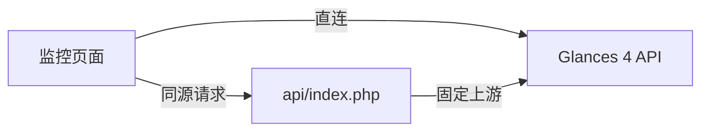

# NAS Dashboard

中文 NAS 监控面板，读取 **Glances 4 REST API**，通过 **Synology Web Station** 托管。
网站无需构建；Docker 可选用于同步代码，同步容器在拉取完成后即停止，不持续运行。
首次访问填写 API 地址，设置保存在当前浏览器。连接、显示偏好和监控模块统一通过
导航栏中的「监控设置」调整。

[功能](#功能) · [部署](#部署) · [故障排查](#故障排查) · [配置](#配置) · [开发与验证](#开发与验证)

## 功能

| 模块     | 概览与详情                            |
| -------- | ------------------------------------- |
| 系统资源 | CPU、内存、负载、温度、系统信息与趋势 |
| 存储空间 | 卷容量、使用率、设备与文件系统        |
| 网络流量 | 收发速率、接口筛选与链路状态          |
| 容器服务 | 容器状态、CPU、内存与可排序列表       |

支持自动刷新、手动刷新和暂停，四个模块共用轮询数据。缺失指标显示 `--`，连接失败保留
上次数据并标记状态。趋势只记录当前页面打开期间的采样；演示数据需通过 `?demo=1`
或设置开关主动启用。

## 部署

部署分为两步：**获取网站文件**，再**选择数据连接方式**。Docker 同步可以搭配直连
或 PHP 同源代理，网站始终由 Web Station 提供。

### 1. 准备环境

- NAS 安装 **Web Station**，并已运行 Glances Web 模式（`glances -w`）。
  API 地址形如 `http://NAS-IP:61208/api/4`。
- 使用同源代理时，安装 **PHP 8.1+**；使用 Docker 同步时，安装 **Container Manager**。
- 选择未占用的门户端口，例如 `6080`。避免 `6000` 等浏览器限制端口。
- 文中 NAS 路径（如 `/volume1/docker/...`）均为**占位符**，实际部署时需替换为 NAS
  上的真实路径。直接部署无需安装 Node.js 或 Git。

### 2. 获取网站文件

**手动上传**：将仓库的完整 `site/` 上传到 NAS，保留 `api/`、`js/`、`vendor/` 等子目录。

**Container Manager 同步**：创建以下两个目录，在 Container Manager 中新建项目，
项目路径选择 `nas-dashboard-sync`，粘贴完整 Compose 配置。同步容器为一次性任务，
拉取仓库并发布 `site/` 后即停止退出，不会持续运行或定时轮询：

```text
/volume1/docker/nas-dashboard-sync/   ← 项目与 Compose 文件
/volume1/docker/nas-dashboard-repo/   ← 网站与私有配置
```

```yaml
services:
  nas-dashboard-sync:
    # 1.0.2 includes the publisher that writes site/build.json for the commit badge.
    image: rasteaks/nas-dashboard:1.0.2
    container_name: nas-dashboard-sync
    restart: "no"
    environment:
      GITSYNC_REPO: https://github.com/RaSteaks/NAS-Dashboard.git
      GITSYNC_REF: main
      GITSYNC_ONE_TIME: "true"
      GITSYNC_SYNC_TIMEOUT: 120s
    volumes:
      # Select this NAS directory's ordinary site/ folder in Web Station.
      - /volume1/docker/nas-dashboard-repo:/data
```

只修改挂载左侧的 NAS 路径，将占位符替换为实际路径，右侧保持 `/data`。迁移旧配置时，
移除旧 `command`、`entrypoint` 和 `/repo` 挂载；拉取指定镜像后重新创建容器。
无需构建镜像或映射端口。

| 环境变量               | 用途                          |
| ---------------------- | ----------------------------- |
| `GITSYNC_REPO`         | 仓库地址                      |
| `GITSYNC_REF`          | 分支、标签或提交，默认 `main` |
| `GITSYNC_ONE_TIME`     | 保持 `true`，每次启动同步一次 |
| `GITSYNC_SYNC_TIMEOUT` | 同步超时，示例为 `120s`       |

需要网络代理时，可在 `environment` 添加 `HTTPS_PROXY`、`HTTP_PROXY` 或 `NO_PROXY`。
代理地址必须能从容器访问。

启动项目后，容器拉取仓库并发布 `site/`，完成后**自动停止**——容器仅在同步期间短暂
运行，不持续驻留。日志应出现以下内容，最终退出码为 **0**：

```text
publish: complete; Web Station root is /data/site
```

`updated successfully` 只说明 Git 下载成功，仍需确认发布日志。同步后的目录如下：

```text
nas-dashboard-repo/
├── site/        ← 普通目录，Web Station 文档根目录
│   ├── index.html
│   ├── build.json ← 实际同步到的完整 commit
│   ├── api/index.php
│   └── js/、vendor/ 等网站文件
├── config/      ← 使用同源代理时，自行创建 glances.php
├── .sync/       ← 内部 Git 数据，仅 Docker 同步使用
└── current      ← 内部符号链接，File Station 可能不显示
```

Web Station 选择普通的 **`nas-dashboard-repo/site`**，不要选择整个仓库、`current/site`
或 `.sync` 内的目录。若只有 `.sync` 而没有 `site/`，核对镜像版本与发布日志。

### 3. 选择数据连接方式

| 项目                 | 直连 Glances                   | PHP 同源代理                   |
| -------------------- | ------------------------------ | ------------------------------ |
| Web Station 服务类型 | 静态网站                       | 本机／原生脚本语言网站 → PHP   |
| 面板中的地址         | `http://NAS-IP:61208/api/4`    | `./api/index.php`              |
| 上游访问者           | 浏览器，需要 Glances 允许 CORS | NAS 上的 PHP，凭据保存在服务端 |
| HTTPS 页面           | Glances 也需提供 HTTPS         | PHP 可访问内网 HTTP 上游       |



#### 直连

1. 在 Web Station 新建静态网站，文档根目录指向 `site/`。
2. 创建关联该服务的网络门户，授予 `http` 组读取网站和遍历父目录的权限。
3. 打开门户，在监控设置中填写 Glances API 地址，测试成功后保存。

若遇到跨域、HTTPS 混合内容或上游认证问题，改用同源代理。

#### PHP 同源代理

1. 在“脚本语言设置 → PHP”创建配置文件，在“扩展”中启用 **`curl`**。
2. 新建 **本机／原生脚本语言网站 → PHP**，选择该配置，文档根目录指向普通 `site/`，
   HTTP 后端可选 Nginx。网络门户必须关联这个 PHP 服务；安装 PHP 不会改变已有静态网站。
3. 参照 [`config/glances.example.php`](./config/glances.example.php)，在 `site/` 同级创建
   私有 `config/glances.php`：

   ```php
   <?php
   // 配置留在公开的 site/ 之外；地址由 NAS 上的 PHP 访问。
   return [
       'api_url' => 'http://NAS-IP:61208/api/4',
   ];
   ```

   PHP 与 Glances 同机且 `61208` 已在宿主机开放时，可使用 `127.0.0.1`。上游认证按
   示例文件填写 `username` / `password` 或 `token`。

4. 确认 PHP 能读取 `site/api/index.php` 与私有配置，并遍历父目录。若启用 `open_basedir`，
   保留原有条目，加入实际 `site/` 和 `config/` 绝对路径，以冒号分隔。
   也可通过服务端 `GLANCES_CONFIG` 指定其他私有配置文件的绝对路径。
5. 在监控设置中选择“同源代理”，填写 `./api/index.php`，测试成功后保存。

私有配置仅放在公开网站目录之外的 `config/` 或其他私有路径，不放入 `site/`、`.sync/`、
`current/` 或 Git。代理只转发固定上游的 GET 监控请求，不接受浏览器传入的上游地址。

### 4. 后续更新

- **手动部署**：替换完整 `site/`，保留同级 `config/glances.php`。
- **Docker 同步**：再次启动已停止的容器，确认发布日志和退出码：

  ```sh
  docker start -a nas-dashboard-sync
  docker logs --tail 100 nas-dashboard-sync
  docker inspect nas-dashboard-sync --format '{{.State.ExitCode}}'
  ```

- **镜像或 Compose 配置变更**：拉取镜像并重新创建容器，普通“启动／重启”不会更换镜像。
  将项目镜像改为 `rasteaks/nas-dashboard:1.0.2`，在 Container Manager 中拉取新镜像并
  重建项目，再同步一次。`1.0.1` 不生成 `build.json`，只更新 Git 中的网站文件不会补上
  版本号。从 `1.0.0` 迁移时保留数据目录，发布普通 `site/` 后更新 Web Station 根目录。

Docker 发布会整体替换 `site/`，本地定制需先备份；同级 `config/` 保留。Git 同步失败或
缺少 `site/index.html` 时不会发布。目录替换存在短暂空隙，完成后再刷新，并复核新目录的
群晖 ACL。此方案每次启动只同步一次，不定时轮询，也不随 NAS 开机自动更新。

发布容器会同时把同步到的 commit 写入 `site/build.json`，页面左下角的侧栏底部显示
`GitHub ea66130`，点击可在新标签页查看对应提交，悬停可查看完整 commit。窄屏时改在
页脚显示。版本号来自实际发布的代码，每次打开页面都重新读取，不使用浏览器缓存。
手动部署没有该文件，版本号自动隐藏。更新后刷新页面，用版本号或直接访问
`/build.json` 确认线上版本；若该文件返回 404，先核对是否已升级同步镜像并重建容器。
若版本号没有变化，先核对同步结果，再尝试强制刷新。

## 故障排查

先查看“测试连接”的提示，再直接访问对应接口。根据 **HTTP 状态和响应正文** 定位，
不要仅凭 404 或某个权限列表推断原因。

### 同源代理返回 404

“未找到接口，请检查 API 路径”表示代理请求收到 **HTTP 404**。在面板所在目录下打开
`api/index.php?plugins=cpu,mem`，例如：

```text
http://NAS-IP:6080/api/index.php?plugins=cpu,mem
```

若页面部署在子路径下，保留该子路径；协议、域名和端口均应与面板一致。
`File not found.` 表示 PHP 未能定位入口脚本，**不能单凭它认定权限不足**。

按顺序检查：

1. **文件与目录**：当前 Web Station 根目录内应同时存在 `index.html` 和 `api/index.php`。
   迁移到 `nas-dashboard-repo/site` 后，检查服务是否仍指向旧的 `nas-dashboard/site`。
2. **门户与 PHP 服务**：当前访问端口应关联正确的 PHP 网站及其 PHP 配置，不能只安装 PHP
   或编辑另一个网站的配置。
3. **有效权限**：检查 `http` 组及实际 PHP 运行用户能否读取入口脚本、遍历全部父目录。
   File Station 的授权需覆盖当前 `site/` 的子文件夹和文件；同步替换目录后重新核对。
4. **PHP 目录限制**：若启用 `open_basedir`，允许路径需覆盖迁移后的真实目录。
   授予文件“全部权限”不会改变 PHP 的目录限制或脚本映射。
5. **已授权仍失败**：查看 Web Station 对应门户及 PHP 错误日志，查找
   `Primary script unknown`、`Unable to open primary script`、`Permission denied` 或
   `open_basedir`。按日志核对入口脚本的实际映射路径（`SCRIPT_FILENAME`），修正根目录、
   门户关联或权限后保存并应用配置，再访问诊断接口。

成功标准为 **HTTP 200、`data.cpu` / `data.mem` 有值、`errors` 为 `{}`**。
返回 200 但 `errors` 中有 Glances 错误，说明代理已执行，应继续排查上游。

### 代理配置与上游错误

| 响应或现象                                         | 处理方式                                                        |
| -------------------------------------------------- | --------------------------------------------------------------- |
| PHP 源码、下载 PHP 文件或非 JSON                   | 核对门户关联的 PHP 服务，确认脚本确实执行                       |
| 503，`Enable the PHP curl extension`               | 在网站实际使用的 PHP 配置中启用 `curl`                          |
| 503，`Configure the Glances API URL on the server` | 核对 `config/glances.php`、`api_url`、读取权限和 `open_basedir` |
| 503，`Invalid server configuration`                | 配置文件必须返回 PHP 数组，对照示例文件修正                     |
| `Glances 返回 HTTP …`                              | 检查上游 `/api/4` 路径、协议、认证及响应正文                    |
| `Glances 无法连接或响应超时`                       | 从 NAS 验证上游地址和端口，检查 Glances 与防火墙                |
| HTTPS 上游证书错误                                 | 使用受信任证书，或将固定上游配置为可访问的内网 HTTP             |

在 NAS 终端验证上游（将地址换成实际值）：

```sh
curl -i 'http://127.0.0.1:61208/api/4/cpu'
```

若直连正常而代理提示 Glances HTTP 503，检查 NAS 网络代理。PHP 已对 `localhost`
及私有／保留 IP 绕过环境代理；内网域名可加入 PHP 服务的 `NO_PROXY`，或比较：

```sh
curl --noproxy '*' -i 'http://127.0.0.1:61208/api/4/cpu'
```

### 同步容器不存在

`No such container: <12位ID>_nas-dashboard-sync` 表示 Docker 找不到该名称。带 ID 的
名称可能来自 Compose 重建时的临时名称，常见于更新镜像或重新创建后的旧记录。

1. 刷新 Container Manager，查看所有容器，包括已停止的 `nas-dashboard-sync`。
2. 若正式名称的容器存在，从新条目查看日志并操作；若不存在，在原项目执行“构建”，
   成功后再“启动”。“启动”只操作已有容器，不会创建缺失的容器。
3. 若构建失败，查看最近一次项目构建日志，按实际错误检查镜像拉取、挂载路径或名称冲突。
   保留原数据目录与私有配置，不通过删除网站数据解决容器记录问题。

同步成功后停止且退出码为 0 是正常状态；停止本身不会删除容器。

### 页面、直连与数据问题

| 现象                              | 检查与处理                                                              |
| --------------------------------- | ----------------------------------------------------------------------- |
| `about:blank` / `ERR_UNSAFE_PORT` | 手动输入门户地址，避开 `6000` 等限制端口；`curl` 可访问不代表浏览器允许 |
| 门户 403 / 404                    | 检查 Web Station、文档根目录、门户关联与有效读取权限                    |
| 样式或脚本 404                    | 完整上传 `site/`，保留 `js/`、`vendor/` 等目录                          |
| 直连失败或 CORS 错误              | 确认 Glances Web 模式和 `/api/4/cpu` 可访问，检查 CORS 或改用同源代理   |
| HTTPS 面板连接 HTTP API           | 为 Glances 配置 HTTPS，或通过同源代理连接内网 HTTP                      |
| 温度、容器或卷缺失                | 检查 Glances 的权限、挂载和插件；存储卷同时核对 `volumePattern`         |
| 网络数据缺失                      | 检查接口筛选；虚拟接口默认忽略，可通过 `networkInterfaces` 显式指定     |

Glances 端口避免直接暴露公网，使用 VPN 或认证入口。面板展示范围取决于 Glances
实际可见的数据；容量信息不代表 RAID / SMART 健康，网络速率使用 `*_rate_per_sec`，
`time_since_update` 是采样年龄。

## 配置

公共默认值位于 [`site/config.json`](./site/config.json)，浏览器已保存的连接设置优先。
公共配置不填写凭据。

| 配置项                              | 默认值与作用                                    |
| ----------------------------------- | ----------------------------------------------- |
| `name` / `subtitle`                 | `我的 NAS` / `Synology · 系统监控`              |
| `api`                               | `mode: direct`，`url` 为空，首次访问填写        |
| `refreshSeconds` / `timeoutSeconds` | 刷新间隔 `5` 秒，超时 `8` 秒                    |
| `historyMinutes`                    | 当前页面保留 `15` 分钟趋势                      |
| `volumePattern`                     | `^/volume[0-9]+$`，筛选群晖存储卷               |
| `networkInterfaces`                 | `[]`，自动筛选；填写接口名可显式指定            |
| `networkIgnorePattern`              | 忽略回环和常见虚拟接口，具体正则见配置文件      |
| `widgets`                           | `resources`、`storage`、`network`、`containers` |
| `unit` / `unitBase`                 | `auto` / `1024`，字节显示单位与换算进制         |
| `thresholds`                        | CPU、内存、存储为 `85`，温度为 `70`             |

## 开发与验证

本地开发需要 **Node.js 22.12+ 或 24**：

```sh
npm ci
npm run dev
```

打开终端给出的地址。本地同源代理由 Node.js 模拟，无需 PHP：复制 `.env.example` 为
`.env.local`，填写 `GLANCES_API_URL` 后重新运行 `npm run dev`；面板地址仍使用
`./api/index.php`。NAS 上的 PHP 代理使用前述私有配置，不会读取这份本地 `.env.local`。

| 命令                            | 检查内容                                     |
| ------------------------------- | -------------------------------------------- |
| `npm run typecheck`             | JSDoc / TypeScript 类型                      |
| `npm test`                      | 单元测试                                     |
| `npm run format:check`          | Prettier 格式                                |
| `npm run test:e2e`              | 浏览器端到端与无障碍检查                     |
| `npm run test:docker`           | 真实容器同步、目录发布、失败保留与文档一致性 |
| `docker compose config --quiet` | Compose 配置                                 |

浏览器测试首次运行需 `npx playwright install chromium`，也可用
`PLAYWRIGHT_CHANNEL=chrome` 选择已安装的 Chrome。Docker 测试需要 Docker 与 Git，
会构建镜像并使用临时仓库；本地验证不替代 NAS ACL、PHP 和门户实测。

<details>
<summary>扩展监控模块</summary>

1. 在 `site/js/core/types.js` 补充类型，实现 `WidgetDefinition` 并注册到
   `site/js/widgets/index.js`，声明所需 `plugins`。
2. 新增模块 ID 时同步更新类型与默认配置；详情页实现 `ViewDefinition` 并注册到
   `site/js/views/index.js`，复用轮询数据。
3. 新增 API 插件时同步更新 PHP 与开发代理的允许列表。

项目方案见 [`AGENT.md`](./AGENT.md)，视觉约定见 [`DESIGN.md`](./DESIGN.md)。

</details>

<details>
<summary>维护者：构建与发布镜像</summary>

镜像基于 [git-sync v4.7.1](https://github.com/kubernetes/git-sync/tree/v4.7.1)，
增加普通目录发布脚本。当前版本为 `1.0.2`，提供 `linux/amd64` 与 `linux/arm64`，
包含 `build.json` 生成逻辑和发布 commit 日志。网站代码更新只需启动同步容器；
同步程序改变才需发布新镜像。

```sh
docker build -t nas-dashboard:1.0.2 docker
npm run test:docker
```

测试通过后选择未发布的新标签，保留已有版本。首次创建构建器：

```sh
docker buildx create --name nas-dashboard-builder --driver docker-container
```

以下 `1.0.3` 仅是下次发布的标签示例，不覆盖已发布的 `1.0.2`。取得发布授权后，
登录并发布双架构镜像；版本与源码提交会写入镜像标签：

```sh
docker login --username rasteaks
IMAGE_TAG=1.0.3
docker buildx build --builder nas-dashboard-builder \
  --platform linux/amd64,linux/arm64 \
  --build-arg VERSION="$IMAGE_TAG" --build-arg VCS_REF="$(git rev-parse HEAD)" \
  -t "rasteaks/nas-dashboard:$IMAGE_TAG" -t rasteaks/nas-dashboard:latest \
  --push docker
```

</details>

## 参考与许可

- [Glances REST API](https://glances.readthedocs.io/en/latest/api/restful.html)
- [Docker 镜像](https://hub.docker.com/r/rasteaks/nas-dashboard)
- [Web Station 网页服务](https://kb.synology.com/index.php/tr-tr/DSM/help/WebStation/application_webserv_webservice?version=7)
- [Web Station PHP 配置](https://kb.synology.com/index.php/en-us/DSM/help/WebStation/application_webserv_php?version=7)
- [Web Station 文件权限](https://kb.synology.com/tr-tr/DSM/tutorial/What_should_I_set_permissions_to_folders_for_websites)
- [Container Manager 项目操作](https://kb.synology.com/en-global/DSM/help/ContainerManager/docker_project)
- [Compose 临时容器命名](https://github.com/docker/compose/blob/1.29.2/compose/container.py)
- [PHP-FPM 入口脚本错误](https://github.com/php/php-src/blob/PHP-8.1/sapi/fpm/fpm/fpm_main.c)
- [浏览器端口限制](https://fetch.spec.whatwg.org/#port-blocking)

项目使用 [MIT License](./LICENSE)。部署时保留
[`site/vendor/LICENSES.txt`](./site/vendor/LICENSES.txt) 中的 Chart.js 与 Lucide 许可文本。
