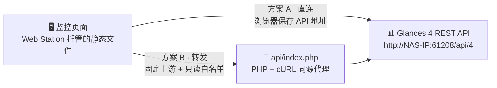
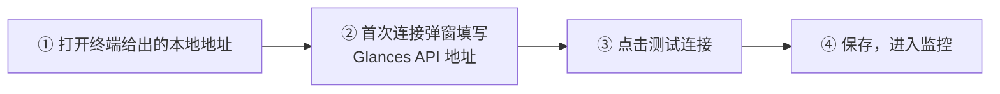
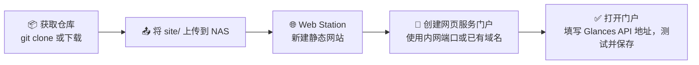
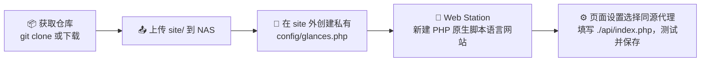

<div align="center">

# NAS Dashboard

**中文 NAS 监控面板** · 读取 Glances 4 REST API · Web Station 托管 · Docker 可选同步代码

部署后第一次访问填写 API 地址即可使用；地址与展示偏好仅保存在当前浏览器。
不内置 NAS IP。Web Station 负责网站服务；Docker 只负责把仓库同步到指定 NAS 目录。

[](https://nodejs.org)
[](#-验证)
[](#-部署到-nas)
[](https://glances.readthedocs.io/en/latest/api/restful.html)
[](./LICENSE)

[功能一览](#-功能一览) · [数据链路](#-数据链路) · [快速开始](#-快速开始) · [部署上线](#-部署到-nas) · [Docker 同步代码](#方案-ccontainer-manager-同步代码web-station-托管) · [常见问题](#-常见问题与排查) · [配置项](#-站点默认配置) · [使用须知](#-使用须知)

</div>

---

## ✨ 功能一览

页面分为运行概览与四个分类详情页，导航切换视图（`#resources` 等 hash 路由），
移动端在顶栏下方提供横向视图切换条：

| 模块        | 概览摘要               | 详情页追加内容                                                       |
| ----------- | ---------------------- | -------------------------------------------------------------------- |
| 🖥️ 系统资源 | 指标卡 + CPU/内存趋势  | CPU 用户态/内核态/I/O 等待分解、全部温度传感器、系统信息、独立趋势图 |
| 💾 存储卷   | 各卷容量列表           | 总容量/已用/可用汇总、每卷设备名与文件系统明细                       |
| 🌐 网络     | 收发速率趋势与接口筛选 | 接口明细表：链路状态、速率、链路速度、累计收发字节                   |
| 📦 容器     | 状态/CPU/内存表格      | 运行汇总（总数/运行中/CPU 与内存合计）、可排序明细表                 |

所有模块共享：

- 自动刷新、手动刷新、暂停；请求完成后再安排下一次，不会重叠。
- 缺失指标显示 `--`，部分失败与数据过期状态始终可见。
- 首次连接弹窗引导填写地址；保存时检查地址格式，也可先点击"测试连接"确认可用。

## 🧭 数据链路

网站由群晖 Web Station 托管，数据获取有两条路径，按需选择。方案 C 只改变
代码下载和更新方式，可搭配方案 A 直连或方案 B 的 PHP 同源代理：



- **方案 A 直连**：浏览器直接访问你填写的 Glances API，依赖 Glances 的 CORS 配置。
- **方案 B 代理**：请求先发给同源的 `api/index.php`，由 PHP 转发到固定上游，
  上游凭据只存在服务端。

## 🚀 快速开始

### 前置要求

- 本地开发需要 Node.js 22.12+ 或 24；直接部署到 NAS 请跳到部署章节，无需安装 Node.js。
- NAS 上运行着 Glances Web 模式（如 `glances -w`），API 地址形如
  `http://NAS-IP:61208/api/4`。

### 本地运行

```sh
npm ci
npm run dev
```



- 地址支持完整形式 `http://NAS-IP:61208/api/4`，也支持省略协议，直接输入
  `NAS-IP:61208/api/4`。
- 想先看效果？通过 `?demo=1` 或设置中的演示开关查看模拟数据，页面会显式标记
  "演示数据"。

### 本地调试同源代理

```sh
cp .env.example .env.local   # 填写 GLANCES_API_URL
npm run dev                  # 填写后（重新）启动开发服务
```

在设置中选择"同源代理"，地址使用 `./api/index.php`。该环境变量只由本地开发服务
（`scripts/serve.mjs`）读取，页面不包含任何服务器地址。

## 📦 部署到 NAS

### 部署前置

1. 在套件中心安装 **Web Station**。使用方案 B 时另需 PHP（8.1+），并在网站
   实际使用的 PHP 配置文件中启用 `curl` 扩展。使用方案 C 自动下载代码时，
   再安装 **Container Manager**；NAS 宿主机无需 Git、Node.js 或额外 nginx。
2. 规划 NAS 上的目录，例如 `/volume3/Video/web/nas-dashboard/`，并确认要使用的
   门户端口未被占用。避开浏览器限制访问的端口，如 `6000`；自定义门户可选择
   未占用的 `6080` 等端口。
3. NAS 已运行 Glances Web 模式并记下地址（`http://NAS-IP:61208/api/4`）。常见
   安装方式：Docker 镜像 `nicolargo/glances`（设置 `GLANCES_OPT=-w`）或通过
   套件 / 包管理器安装。

### 方案对比

|                   | 方案 A · 手动部署直连        | 方案 B · PHP 同源代理  | 方案 C · Docker 同步代码               |
| ----------------- | ---------------------------- | ---------------------- | -------------------------------------- |
| 网站由谁提供      | Web Station                  | Web Station + PHP/cURL | Web Station，容器只下载文件            |
| 代码如何获取      | 下载并上传，或自行 git clone | 与方案 A 相同          | 只粘贴 Compose，容器首次克隆、以后更新 |
| 数据连接方式      | 浏览器直接访问 Glances       | PHP 连接固定上游       | 可选 A 或 B                            |
| Glances 需开 CORS | 是                           | 否                     | 取决于选择 A 还是 B                    |
| 上游认证          | 建议改用方案 B               | 凭据仅保存在服务端     | 需要认证时搭配 B                       |
| HTTPS 页面        | 必须连接 HTTPS API           | 上游可使用内网 HTTP    | 取决于选择 A 还是 B                    |
| NAS 额外要求      | 无                           | PHP 8.1+，启用 curl    | Container Manager                      |
| 更新方式          | 上传新文件或自行 git pull    | 同 A，保留私有配置     | 手动启动同步容器，完成后自动退出       |

### 方案 A：静态站点



1. 将仓库中的 `site/` 目录上传到 NAS，例如
   `/volume3/Video/web/nas-dashboard/site`。无需任何构建步骤。
2. 在 Web Station 创建静态网站，文档根目录选择上述 `site` 目录。
3. 创建网页服务门户，使用你的内网端口或已有域名；`http` 组须有读取权限。
4. 打开门户，填写你的 Glances API 地址，测试并保存。

说明：

- Web Station 只需要 `site/` 里的静态文件，NAS 和开发电脑都不需要构建步骤。
- 发布新版本：更新仓库后重新拷贝 `site/`。站点源码直接提交在 `site/` 目录，
  若 NAS 上克隆了仓库，`git pull` 即完成发布，没有编译产物环节。
- HTTP 内网页面可连接 HTTP API；HTTPS 页面必须连接 HTTPS API，或改用方案 B。
  浏览器设置弹窗会检查这个限制。
- 直连依赖 Glances 的 CORS 配置；最新版本的默认设置允许不带凭据的跨域访问，
  实际行为以你安装的 Glances 版本和配置为准。

### 可选：生成部署 ZIP

在开发电脑上使用 `zip` 打包即可，不需要编译。使用新的临时目录，避免旧 ZIP 中
残留已经删除的文件。解压后，将 Web Station 的文档根目录指向 `site/`。

```sh
package_dir="$(mktemp -d)"
zip -qr "$package_dir/nas-dashboard-webstation.zip" site config/glances.example.php README.md LICENSE
mkdir -p artifacts
mv "$package_dir/nas-dashboard-webstation.zip" artifacts/nas-dashboard-webstation.zip
rmdir "$package_dir"
```

只打包上述发布文件，私有 `config/glances.php`、`.env`、开发依赖和测试结果不进入
部署包。`artifacts/` 已被 Git 忽略；使用 NAS 上的 `git pull` 更新时不需要生成 ZIP。

### 方案 B：PHP 同源代理



如果已有服务的编辑窗口标题是“编辑静态网站”，需要另建 PHP 网页服务。安装 PHP
不会自动改变静态网站的服务类型；“HTTP 后端服务器”可继续使用 Nginx，PHP 配置
在“原生脚本语言网站”中选择。“同源代理”则是监控面板中的连接方式。

1. 在 Web Station → 脚本语言设置 → PHP 中，创建或编辑 PHP 8.1+ 配置文件，
   在“扩展”选项卡勾选 `curl` 并保存。记下该配置文件的名称。
2. 在网页服务 → 新增 / 创建中，选择“原生脚本语言网站”→ PHP，服务名称可填
   `dashboard-php`，并选择上一步的 PHP 配置文件。
3. 文档根目录指向 NAS 上的 `site` 目录（名称可自定），其中应直接包含
   `index.html` 与 `api/`；HTTP 后端服务器可选择 Nginx。
4. 在网页门户 → 创建 → 网页服务门户中，关联 `dashboard-php` 服务，按需配置
   HTTP / HTTPS 域名与端口。打开这个 PHP 服务对应的门户进行后续测试。
5. 保持以下布局，`config/` 必须位于所有公开网页根目录之外：

   ```text
   /volume3/Video/web/nas-dashboard/
   ├── config/
   │   └── glances.php          ← 私有配置，绝不放入 site/
   └── site/                    ← Web Station 文档根目录
       ├── index.html
       ├── config.json
       ├── styles.css
       ├── js/
       ├── vendor/
       ├── favicon.svg
       └── api/index.php
   ```

6. 使用仓库中的 `config/glances.example.php` 创建私有 `config/glances.php`，填写
   `api_url`。最小配置如下；将 `NAS-IP` 替换为 PHP 服务能访问的 Glances 主机地址：

   ```php
   <?php
   // 私有配置放在 site/ 外，由 NAS 上的 PHP 访问内网 Glances。
   return [
       'api_url' => 'http://NAS-IP:61208/api/4',
   ];
   ```

   Glances 默认提供 HTTP API，按实际协议填写。若 PHP 与 Glances 位于同一台 NAS
   且接口可通过回环地址访问，也可使用 `http://127.0.0.1:61208/api/4`；这里的
   `127.0.0.1` 指 PHP 所在的运行环境。需要上游认证时，在私有配置中填写
   `username` / `password` 或 `token`。

7. 允许 PHP 读取这个配置路径，包括 `open_basedir` 和 `http` 组读取权限。在当前
   PHP 配置文件中保留已有的允许路径，并添加私有 `config/` 的实际绝对路径；多个
   路径使用冒号分隔。也可通过服务端环境变量 `GLANCES_CONFIG` 指定其他私有
   绝对路径。
8. 在监控面板 → 监控设置中选择“同源代理”，地址填写 `./api/index.php`，点击
   “测试连接”，成功后保存。

这条链路由浏览器访问面板同源的代理，再由 NAS 上的 PHP 访问 Glances。面板使用
HTTPS 时，上游仍可使用内网 HTTP；浏览器无需直接连接 Glances 的内网 IP。

代理安全边界：

- 只接受 GET 请求和已允许的监控插件，从管理员配置读取固定上游，不接受浏览器
  提供的目标主机。
- CPU、内存、网络、文件系统等各请求并行读取，某个插件失败不影响其他插件。
- 容器响应会移除命令等与本页面无关的字段；上游凭据不进入前端或 Git。
- 监控数据的访问控制由部署入口负责，生产门户可使用已有的 VPN 或认证入口。
- 更新版本只需替换 `site/`；私有 `config/glances.php` 与浏览器里保存的设置不受
  影响。

### 方案 C：Container Manager 同步代码，Web Station 托管

**只需要一份 Compose YAML，不需要先克隆仓库，也不构建镜像。** 容器使用带 Git 的
`alpine/git` 镜像，将完整仓库直接保存到指定 NAS 目录；Web Station 使用其中的
`site/`。Docker 中没有 nginx/PHP，不映射网站端口，不产生第二份仓库。

#### 1. 准备两个独立目录

在 File Station 中创建以下目录（存储卷和目录可替换）：

```text
/volume1/docker/nas-dashboard-sync/   ← Container Manager 项目目录，保存 Compose
/volume1/docker/nas-dashboard-repo/   ← 专用代码目录，首次使用时保持为空
```

代码目录不能与 Compose 项目目录相同，否则目录中的 YAML 等文件会导致首次克隆
失败。该路径使用绑定挂载，文件直接保存在 NAS 上，不是 Docker 命名卷。
若父目录已被其他 Web Station 门户公开，请调整门户，确保仓库根目录不会被访问。

#### 2. 创建 Container Manager 项目

1. 在 Container Manager → 项目中创建项目，名称可用 `nas-dashboard-sync`。
2. 项目路径选择 `/volume1/docker/nas-dashboard-sync/`。
3. 选择创建/输入 Compose 配置，粘贴下方**完整 YAML**。
4. 修改 `volumes` 左侧路径为你的代码目录，保留右侧 `/repo`。
5. 创建并启动项目。NAS 需要能访问 Docker Hub 和 GitHub。

下方与仓库根目录的 `docker-compose.yml` 保持一致；只复制这一份即可部署：

```yaml
# Paste this entire file into Container Manager; no host clone or build is needed.
# Web Station serves the bind-mounted site/ directory. This container only syncs Git.
services:
  nas-dashboard-sync:
    image: alpine/git:latest
    container_name: nas-dashboard-sync
    restart: "no"
    environment:
      REPO_URL: ${REPO_URL:-https://github.com/RaSteaks/NAS-Dashboard.git}
      BRANCH: ${BRANCH:-main}
      PULL_RETRIES: ${PULL_RETRIES:-5}
      GIT_TERMINAL_PROMPT: "0"
    volumes:
      # Change the host path to your dedicated, initially empty NAS folder.
      - ${SYNC_DIR:-/volume1/docker/nas-dashboard-repo}:/repo
    entrypoint: ["/bin/sh", "-c"]
    # Double dollars defer shell variables to the container, not Compose.
    command:
      - |
        set -eu
        umask 022
        REPO_DIR="$${REPO_DIR:-/repo}"
        RETRIES="$${PULL_RETRIES:-5}"
        case "$$RETRIES" in
          ''|0|*[!0-9]*) echo "sync: PULL_RETRIES must be a positive integer" >&2; exit 1 ;;
        esac
        git config --global --replace-all safe.directory "$$REPO_DIR"

        sync_repo() {
          if [ ! -d "$$REPO_DIR/.git" ]; then
            git clone --depth 1 -b "$$BRANCH" "$$REPO_URL" "$$REPO_DIR" || return 1
          else
            # Explicit returns matter: the until loop disables implicit errexit here.
            git -C "$$REPO_DIR" remote set-url origin "$$REPO_URL" || return 1
            git -C "$$REPO_DIR" fetch --depth 1 origin "$$BRANCH" || return 1
            # Check the incoming layout before replacing a working website.
            git -C "$$REPO_DIR" cat-file -e FETCH_HEAD:site/index.html || return 1
            git -C "$$REPO_DIR" reset --hard FETCH_HEAD || return 1
          fi
          test -f "$$REPO_DIR/site/index.html"
        }

        attempt=1
        until sync_repo; do
          if [ "$$attempt" -ge "$$RETRIES" ]; then
            echo "sync: failed after $$RETRIES attempts; see Git errors above" >&2
            exit 1
          fi
          echo "sync: attempt $$attempt/$$RETRIES failed; retrying in 3s" >&2
          attempt=$$((attempt + 1))
          sleep 3
        done

        # Only advertise a new version after a successful sync; keep private files.
        git -C "$$REPO_DIR" rev-parse --short HEAD > "$$REPO_DIR/site/VERSION"
        echo "sync: complete; Web Station root is $$REPO_DIR/site (inside container)"
        cat "$$REPO_DIR/site/VERSION"
```

`$$` 是 Compose 的转义语法，粘贴时不要改成 `$`。镜像自带 Git，无需运行
`apk add`。镜像与挂载说明见 [alpine/git 项目](https://github.com/alpine-docker/git)、
[Docker 绑定挂载文档](https://docs.docker.com/engine/storage/bind-mounts/) 和
[Compose 变量转义说明](https://docs.docker.com/reference/compose-file/interpolation/)。
示例使用 `latest`；需要固定镜像版本时，可换成镜像项目提供的版本标签或摘要。

#### 3. 确认同步完成

查看 `nas-dashboard-sync` 容器日志，应看到 `sync: complete` 和提交 ID。
容器随后显示“已停止”，**退出码 0 表示任务成功，这是正常状态**。它不是常驻
网站服务，不需要配置健康检查或自动重启。退出码非 0 时先检查日志，不要将停止
状态一律理解为成功。

File Station 中应出现：

```text
/volume1/docker/nas-dashboard-repo/
├── .git/
├── config/                  ← 使用代理时，在此创建私有 glances.php
├── site/                    ← Web Station 文档根目录
│   ├── index.html
│   ├── VERSION              ← 最近一次成功同步的短提交 ID
│   └── ...
└── 其他仓库文件
```

#### 4. 配置 Web Station

- **直连 Glances**：按方案 A 创建静态网站，文档根目录设为
  `/volume1/docker/nas-dashboard-repo/site`。
- **PHP 同源代理**：按方案 B 创建 PHP 网站，根目录仍是上述 `site/`，启用 curl，
  在同级 `config/` 中创建私有配置并设置 PHP 读取权限。
- 给 Web Station 的 `http` 组授予站点及父目录所需的读取/遍历权限；同步容器需有
  代码目录写权限。脚本使用 `umask 022`，但不会修改 NAS 已有的共享目录 ACL。
- 在 Web Station 创建对应网页服务门户，例如选择未占用的 `6080` 端口，然后访问
  `http://NAS-IP:6080`。这里的端口由 **Web Station** 配置，Compose 不配置 `PORT`。

只把 `site/` 设为公开根目录，不能公开整个仓库或私有 `config/`。
打开页面后按所选方式测试连接并保存。面板只展示监控数据，Glances 仍需另外运行。

#### 5. 后续更新

在 Container Manager 中选中已停止的 `nas-dashboard-sync` 容器，点击**启动**。
每启动一次执行一次同步，完成后再次退出；Web Station 始终负责提供网站。
可选的 SSH 等效命令：

```sh
docker start -a nas-dashboard-sync
```

检查最近日志与退出码：

```sh
docker logs --tail 100 nas-dashboard-sync
docker inspect nas-dashboard-sync --format '{{.State.ExitCode}}'
```

打开网站的 `/VERSION`，或查看 NAS 上 `site/VERSION`，可确认最近一次成功同步的
提交。更新完成后刷新页面；覆盖站点文件期间并非原子切换，短暂读取到新旧混合
资源时，等待同步完成后再刷新。

- 默认同步 `main`。修改 `REPO_URL`、`BRANCH`、重试次数或挂载路径后，需要在
  Container Manager 中应用新 Compose 并重新创建容器；只点击启动不会更改配置。
- Compose 脚本已保存在 Container Manager 项目中，仓库更新不会自动替换这份脚本。
  后续同步逻辑有变更时，需要重新粘贴新版 YAML 并应用；无需构建镜像。
- 默认失败重试最多 5 次、间隔 3 秒，耗尽后退出码为 1。拉取失败不会重置旧检出或
  更新 `VERSION`，已部署站点仍由 Web Station 提供；网络恢复后重新启动同步容器。
- 此方案不会随 NAS 开机自动更新，也不进行定时轮询；网站服务由 Web Station 管理。
- 同步会覆盖仓库中**已跟踪文件**的本地修改。站点定制应提交到所选仓库；脚本不执行
  `git clean`，未跟踪的私有 `config/glances.php` 会保留。默认面向公开仓库，私有
  仓库需要单独配置认证，不要将凭据写进 README 或提交到 Git。

#### 从旧 nginx 容器方案迁移

先保留旧部署，在新的专用 NAS 目录完成同步并验证 Web Station 门户，再停止旧的
`nas-dashboard` 容器。新服务名为 `nas-dashboard-sync`，与旧容器分开。
旧命名卷不会自动迁移；其中自行修改的文件和私有配置应先备份再按需迁移。
确认新站点可用后，再自行清理旧容器及卷。浏览器设置按来源保存，更换域名、协议
或端口后，需要重新填写 API 地址。

## 🧯 常见问题与排查

排查顺序建议：先看页面状态栏与设置里的“测试连接”，再看浏览器控制台；方案 B 还
可以直接查看 PHP 响应里的 `error` 字段，报错信息会指明问题出在扩展、配置还是
上游。

### 页面无法打开

| 现象                         | 可能原因                                                  | 处理方式                                           |
| ---------------------------- | --------------------------------------------------------- | -------------------------------------------------- |
| 打开后地址栏是 `about:blank` | 新标签页没有完成导航，需检查门户链接和浏览器端口限制      | 手动输入门户实际 URL，按下面步骤检查端口与访问方式 |
| 浏览器报 `ERR_UNSAFE_PORT`   | 门户使用了 `6000` 等浏览器限制访问的端口                  | 将门户端口改为未占用的 `6080` 等允许访问的端口     |
| 门户 403 / 404               | Web Station 未启用、文档根目录指错、`http` 组没有读取权限 | 检查 Web Station 服务状态、门户与共享目录权限      |
| 页面能打开但样式或脚本 404   | 只上传了部分文件                                          | 完整上传 `site/`，包括 `js/` 与 `vendor/`          |

#### `about:blank` / `ERR_UNSAFE_PORT` 排查步骤

1. 检查网页门户的协议、域名与端口。`6000` 在浏览器限制端口列表中，Chromium
   访问时会报 `ERR_UNSAFE_PORT`，新标签页可能停在 `about:blank`。将对应门户
   端口改为未占用的 `6080` 等允许访问的端口；HTTP 与 HTTPS 都受端口限制影响。
2. 手动输入实际门户地址：基于端口的 HTTP 门户可使用
   `http://NAS-IP:6080/`；基于主机名称的门户使用其绑定的域名，并匹配所配置的
   协议与端口。
3. 若访问仍返回 403 / 404，检查门户绑定的网页服务、文档根目录是否直接包含
   `index.html`，以及 `http` 组的读取权限。仓库首页位于 `site/index.html`，
   所以文档根目录通常应指向 `nas-dashboard/site/`。
4. 在同一门户下检查 `index.html`、`styles.css`、`js/main.js` 和 `config.json`
   是否正常返回。`config.json` 返回 JSON 只说明这个静态文件可访问，PHP 代理与
   Glances 连接还需单独验证。

站点没有主动跳转到 `about:blank` 的逻辑，首屏骨架直接写在 `index.html` 中。
终端 `curl` 不使用浏览器的限制端口列表；浏览器端口拦截与服务端 404 可以同时
存在，因此 `curl` 能连接端口并不代表浏览器能访问，改端口后仍需确认首页正常。
端口限制依据见 [Fetch 标准](https://fetch.spec.whatwg.org/#port-blocking)。

### 连接失败（方案 A，或方案 C 搭配直连）

| 现象                                         | 可能原因                                                  | 处理方式                                                       |
| -------------------------------------------- | --------------------------------------------------------- | -------------------------------------------------------------- |
| “测试连接”失败                               | Glances 未以 Web 模式运行、端口不对、防火墙未放行 `61208` | 先用浏览器直接打开 `http://NAS-IP:61208` 验证再回面板保存      |
| 控制台报 CORS 跨域错误                       | Glances 的跨域配置拒绝了面板门户这个来源                  | 检查 Glances 配置的 `[cors]` 允许来源，或改用方案 B            |
| HTTPS 门户下请求被浏览器拦截                 | 混合内容：HTTPS 页面不能请求 HTTP API                     | 为 Glances 启用 HTTPS，或改用同源代理（方案 B）                |
| 填写 `https://NAS-IP:61208/api/4` 后连接失败 | Glances 实际提供 HTTP，HTTPS 握手失败                     | 按实际协议填写；HTTPS 面板使用方案 B，由 PHP 连接内网 HTTP API |
| Glances 开启认证后无法使用                   | 直连模式没有安全保存凭据的位置                            | 改用方案 B，凭据只存在服务端的私有配置里                       |
| 地址能保存但所有指标都是 `--`                | 保存时未先测试，实际连不上或 API 版本路径不对             | 在设置中“测试连接”，确认路径为 Glances 4 的 `/api/4`           |

可先在能访问 NAS 的终端确认 Glances 接口，例如：

```sh
curl -i 'http://NAS-IP:61208/api/4/cpu'
```

将 `NAS-IP` 替换为实际地址，确认响应为 HTTP 200 和 JSON。仅把输入中的 `http://`
改成 `https://` 不会让服务启用 TLS。HTTP 面板可直接使用这个 HTTP API 地址；
HTTPS 面板应使用已配置 HTTPS 的 API，或按方案 B 配置同源代理。

### PHP 同源代理（方案 B）

| 现象                                                   | 可能原因                                                | 处理方式                                                            |
| ------------------------------------------------------ | ------------------------------------------------------- | ------------------------------------------------------------------- |
| 面板提示“代理尚未配置或未启用 PHP / cURL”              | 前端对 HTTP 503 使用统一提示，需查看接口的具体错误      | 在当前门户下访问 `api/index.php?plugins=cpu,mem`，读取 `error` 字段 |
| 接口显示 PHP 源码、下载 PHP 文件或未返回 JSON          | 当前门户未正确执行 PHP                                  | 核对门户关联的原生脚本语言网站及其 PHP 配置                         |
| 响应 503 `Enable the PHP curl extension`               | 当前服务的 PHP 配置未启用 curl 扩展                     | 在网站实际使用的 PHP 配置文件中启用 curl                            |
| 响应 503 `Configure the Glances API URL on the server` | 读不到 `config/glances.php`，或 `api_url` 缺协议 / 主机 | 文件放在 `site/` 之外；确认 `open_basedir` 允许读取；核对 `api_url` |
| 响应 503 `Invalid server configuration`                | 配置文件不是返回数组的 PHP 文件                         | 对照 `config/glances.example.php` 重写                              |
| 代理提示“Glances 返回 HTTP 503”，内网直连正常          | NAS 的网络代理可能拦截了内网请求                        | 在 NAS 上比较普通请求与 `curl --noproxy '*'`，按下面步骤处理        |
| 部分插件提示“Glances 无法连接或响应超时”               | 代理连不上上游（连接超时 2 秒）                         | 在 NAS 上执行 `curl http://127.0.0.1:61208/api/4/cpu` 验证          |
| 上游 HTTPS 报证书错误                                  | 代理强制校验上游证书，自签名证书会失败                  | 内网改用 HTTP 上游，或为上游配置受信任的证书                        |
| 响应 400 `Unsupported monitoring plugin`               | `plugins` 参数超出只读白名单                            | 正常由页面发起不会出现；手动调试请用白名单内的插件名                |

#### PHP 已安装，但仍提示“代理尚未配置或未启用 PHP / cURL”

1. 在当前面板所在的 URL 目录后加上 `api/index.php?plugins=cpu,mem`，直接访问
   代理诊断接口。前端的提示对应 HTTP 503，具体原因以响应里的 `error` 字段为准。
2. 如果响应如下，说明 PHP 已经执行，但运行该接口的 PHP 配置未加载 `curl`：

   ```json
   { "error": "Enable the PHP curl extension in Web Station." }
   ```

3. 在 Web Station → 网页服务中编辑当前 PHP 网站，查看其绑定的 PHP 配置文件
   名称。再进入脚本语言设置 → PHP，编辑**同一个配置文件**，在“扩展”中勾选
   `curl` 并保存，回到面板重新测试连接。
4. `curl` 检查发生在读取 Glances 配置之前。若启用后错误变为
   `Configure the Glances API URL on the server.`，继续检查私有
   `config/glances.php`、`api_url`、`open_basedir` 与读取权限。
5. 成功时，诊断接口应返回 HTTP 200，`data.cpu` 和 `data.mem` 包含有效指标，
   `errors` 为空对象 `{}`；再回到面板测试并保存。仅返回 HTTP 200 或 JSON 并不
   代表上游连接成功，还需检查其中的 `errors`。

#### Glances 返回 HTTP 503，但内网接口正常

在 **NAS 的终端**执行以下两条命令，将 `NAS-IP` 替换为实际 Glances 主机地址：

```sh
curl --connect-timeout 3 --max-time 8 -i 'http://NAS-IP:61208/api/4/cpu'
curl --noproxy '*' --connect-timeout 3 --max-time 8 -i 'http://NAS-IP:61208/api/4/cpu'
```

如果普通请求返回 HTTP 503，绕过代理后返回 HTTP 200 和 Glances JSON，说明请求
经过的网络代理导致了失败。PHP cURL 也可能继承 `http_proxy`、`all_proxy` 等环境
设置，因此电脑直连成功时，NAS 上的 PHP 请求仍可能失败。

本项目的 PHP 接口对 `localhost`、私有及保留 IP 地址使用 `CURLOPT_NOPROXY`，
让配置的 Glances 主机直接连接。IPv4 / IPv6 均支持，公网 IP 和其他主机名称仍
沿用环境中的代理设置。使用内网域名时，可在 PHP 服务的 `NO_PROXY` 中添加该
主机，或改用其实际内网 IP。选项行为见
[libcurl 文档](https://curl.se/libcurl/c/CURLOPT_NOPROXY.html)。

旧版本部署需要更新 NAS 文档根目录下的 `api/index.php`，然后重新访问
`api/index.php?plugins=cpu,mem`；确认 `data.cpu`、`data.mem` 有效且 `errors` 为
`{}`，再在面板中测试并保存连接。

### 数据缺失或显示 `--`

| 现象                        | 可能原因                                              | 处理方式                                                        |
| --------------------------- | ----------------------------------------------------- | --------------------------------------------------------------- |
| 温度不显示                  | Glances 读不到温度传感器                              | 主机安装 lm-sensors；容器部署按官方镜像说明挂载 `/proc`、`/sys` |
| 存储卷为空                  | 挂载点不匹配 `volumePattern`（如 USB 卷、自定义挂载） | 调整 `site/config.json` 的 `volumePattern` 正则                 |
| 容器列表为空或无 CPU / 内存 | Glances 没有 Docker socket 权限                       | 给 Glances 挂载 `/var/run/docker.sock` 并授权                   |
| 网络速率缺失或为 0          | 速率来自两次采样的差值；虚拟接口被默认正则忽略        | 等待一个刷新周期；需要 docker / VPN 接口时显式配置接口列表      |

### 安全提醒

- Glances REST API 默认只读且无认证，`61208` 端口不要直接暴露公网；生产门户走
  VPN 或认证入口（方案 B 的访问控制同样由部署入口负责）。
- 私有 `config/glances.php`、`.env` 与任何凭据都不进入 `site/` 与 Git；一旦怀疑
  泄露，立即轮换 Glances 的账号、密码或 token。

## 🔧 站点默认配置

站点级默认值在 `site/config.json` 中，随 `site/` 一起发布。浏览器保存的连接设置
优先于默认值。公共配置不要填写密码或 token。

| 配置项                 | 说明                                                           | 默认值                                       |
| ---------------------- | -------------------------------------------------------------- | -------------------------------------------- |
| `name` / `subtitle`    | 设备名称和副标题                                               | `我的 NAS` · `Synology · 系统监控`           |
| `api`                  | 留空则首次访问填写；也可设置站点公共默认连接（`mode` + `url`） | `direct`，地址为空                           |
| `refreshSeconds`       | 更新间隔；请求完成后再安排下一次，避免重叠                     | `5`                                          |
| `timeoutSeconds`       | 单次请求超时时间                                               | `8`                                          |
| `historyMinutes`       | 页面内趋势采样的保留时长                                       | `15`                                         |
| `volumePattern`        | 存储卷筛选正则表达式                                           | `^/volume[0-9]+$`                            |
| `networkInterfaces`    | 显式接口列表；为空时忽略回环和常见虚拟接口，优先聚合接口       | `[]`（自动筛选）                             |
| `networkIgnorePattern` | 自动筛选时忽略的接口名正则                                     | `^(lo$\|docker\|veth\|br-\|virbr\|tun\|tap)` |
| `widgets`              | 默认启用的模块                                                 | `resources` `storage` `network` `containers` |
| `thresholds`           | CPU、内存、存储和温度提醒阈值                                  | 均为 `85`，温度 `70`                         |

## 🧩 扩展开发

新增一个监控模块：

1. 在 `site/js/core/types.js` 补充 JSDoc 类型，并实现 `WidgetDefinition`。
2. 注册到 `site/js/widgets/index.js`；模块声明 `plugins`，请求层会自动合并依赖。
3. 需要配套详情页时，在 `site/js/views/` 实现 `ViewDefinition` 并注册到
   `site/js/views/index.js`；视图复用同一轮询数据，首次导航时才挂载。
4. 新增模块 ID 时，同步更新类型定义和默认配置。
5. 类型以 JSDoc 注解表达，`npm run typecheck` 用 tsc 做零产物校验，没有编译步骤。

新增一个 Glances API 插件时，同步更新 PHP 代理与开发代理的允许列表。
全局规范见 `AGENT.md`，视觉与交互约定见 `DESIGN.md`。

## ✅ 验证

| 命令                   | 作用                                       |
| ---------------------- | ------------------------------------------ |
| `npm run typecheck`    | tsc 校验 JSDoc 类型（零产物）              |
| `npm test`             | Vitest 单元测试与 Compose 同步脚本回归测试 |
| `npm run format:check` | Prettier 格式检查                          |
| `npm run test:e2e`     | Playwright 浏览器端到端测试                |

浏览器测试默认使用 Playwright 专用 Chromium，首次运行先执行
`npx playwright install chromium`；也可通过 `PLAYWRIGHT_CHANNEL=chrome` 选择已安装的
Chrome。原生下拉菜单使用浏览器选择 API 验证，键盘测试覆盖焦点、按钮和弹窗。

测试使用隔离配置和模拟接口，覆盖桌面与手机、首次配置、断线、部分失败、模块管理、
键盘、趋势绘制和自动无障碍检查。PHP 解析测试只验证语法，不替代 Web Station 的
PHP / cURL 运行时验证。

Compose 同步脚本测试需要本机安装 Git 和 POSIX `sh`，直接执行 YAML 中的内联脚本，
使用临时本地仓库验证首次克隆、重复启动、仓库和分支切换、失败重试、退出状态及
私有配置保留；不需要 Docker daemon 或访问 GitHub。可单独执行
`npx vitest run tests/docker.test.js`，并用 `docker compose config --quiet` 校验配置。
这些检查不替代 NAS 上的镜像拉取、目录 ACL 和 Web Station 实际访问验证。

## 📌 使用须知

- 趋势只记录当前打开页面期间的采样，不代表 NAS 的长期历史。
- 演示模式显式标记"演示数据"；连接失败不会切换成模拟数值。
- 磁盘容量不代表 RAID 或 SMART 健康。
- 网络速率使用 `bytes_recv_rate_per_sec` / `bytes_sent_rate_per_sec`；
  `time_since_update` 是采样年龄，不能拿来计算每秒速率。
- Glances 容器能看到多少挂载点、温度、容器，页面就展示多少；缺失数据优先检查
  Glances 的权限和挂载。

## 📚 参考链接

随站点分发的 Chart.js 与 Lucide 版权和许可证文本保存在
[`site/vendor/LICENSES.txt`](./site/vendor/LICENSES.txt)，部署时随 `site/` 一起保留。

- [Glances 官方 REST API 文档](https://glances.readthedocs.io/en/latest/api/restful.html)
- [Synology Web Station 部署文档](https://kb.synology.com/en-id/DSM/tutorial/How_to_host_a_website_on_Synology_NAS)
- [Synology Web Station 网页服务类型](https://kb.synology.com/index.php/zh-hk/DSM/help/WebStation/application_webserv_webservice?version=7)
- [Synology Web Station PHP 配置与扩展](https://kb.synology.com/index.php/en-us/DSM/help/WebStation/application_webserv_php?version=7)
- [Fetch 标准：浏览器端口限制](https://fetch.spec.whatwg.org/#port-blocking)
- [MDN：HTTPS 页面中的混合内容限制](https://developer.mozilla.org/en-US/docs/Web/Security/Defenses/Mixed_content)

---

<div align="center">

基于 [MIT License](./LICENSE) 发布 · 监控数据仅供日常巡检参考

</div>
